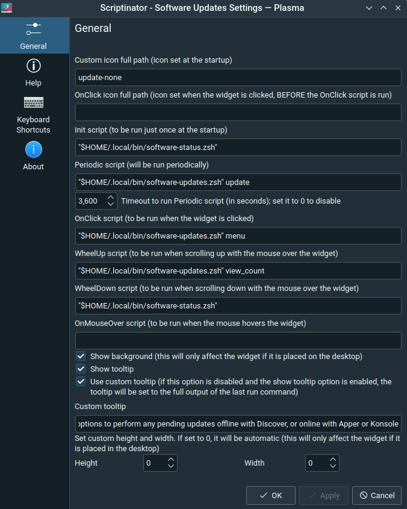

# Software Updater

This example notifies software updates, just like the Plasma Discover Update Notifier, but offers many more options both in terms of viewing the available updates, and how you'd like to update them: use Discover, Apper, or Konsole - a choice the user can make depending on the available updates.

## Installation

1. Install the dependency package YAD and Apper (e.g. `sudo apt install apper yad`).
2. Install the Scriptinator applet.
3. Add the Scriptinator applet to your panel / system tray (set it as "Shown when relevant").
4. Right-click the Scriptinator applet and select "Configure".
5. Configure it as the screenshot below, changing path(s) as appropriate.

## Usage

1. When there are updates, the applet displays an "update-*" icon in the system tray: "update-low", "update-medium", or "update-high", based on the number of updates.
2. Hovering the mouse over the icon displays the tooltip (a brief description of the applet).
3. WheelUp/Down diplays the number of updates, when they were checked last time, and how often they are checked.
4. Clicking the icon launchs a YAD dialog box which lists the available packages; a button to view the full list if they are more 20; and options to perform updates, using Discover, Apper, or Konsole.

## Screenshots

When there are no software updates available, the applet can be seen only in the "Status and Notifications" popup window opened by clicking the down arrow at the right edge of the system tray.

When there are software updates, the applet switches to active state, displaying a system update icon in the tray, and showing its description as tooltip when mouse hovers on it.

The system update icon in the tray has a red dot when there are 30 or more updates, orange if they are between 10-29, and blue if they are under 10.

WheelUp/Down mouse action dislays a popup window showing how many updates are available, when the last check was, how often they are checked, and when the next check is.

Clicking the system update icon in the tray opens a YAD dialog window, with slightly different layouts depending on the number of updates (1, under 5, under 15, under 20 or 20+), followed by options below to view the full list, if there are 20 or more updates; and to perform the update(s) using Discover, Apper or Konsole. The list of upgradable packages are provided by `apt`, while any additional packages that need to be installed as dependency are provided by `pkcon`, listed under different headings.

Performing the updates using Discover might be especially preferrable for "offline updates", when important system software packages are downloaded immediately, but installed after rebooting the computer.

Apper package manager might be preferrable for quick updates that carry no risk when performed immediately without any reboot, such as applications and tools that are not in use or can be closed before the update, and restarted after. Konsole option, on the other hand, simply opens a terminal window, and starts executing the command `pkcon update`, which might be preferred especially by advanced-level users.

